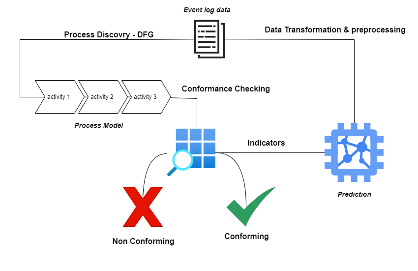
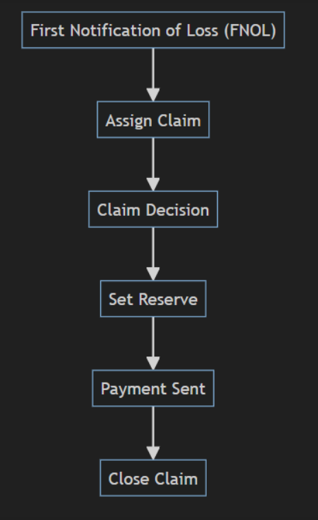
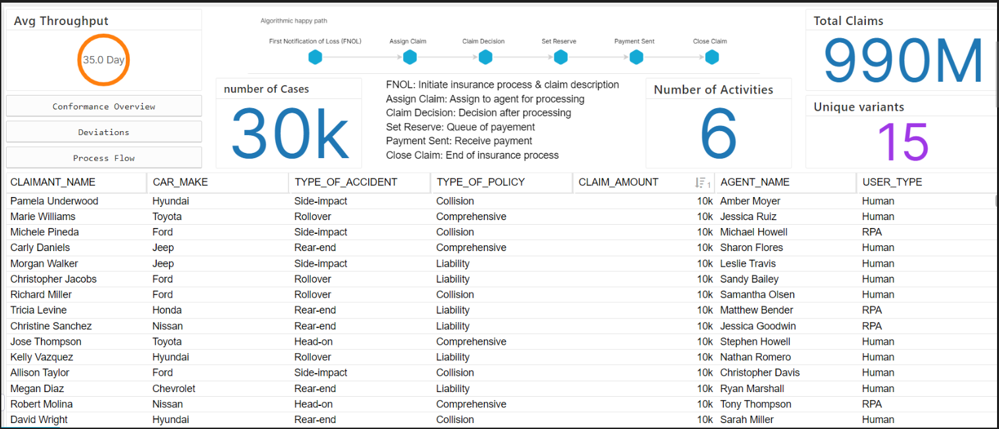
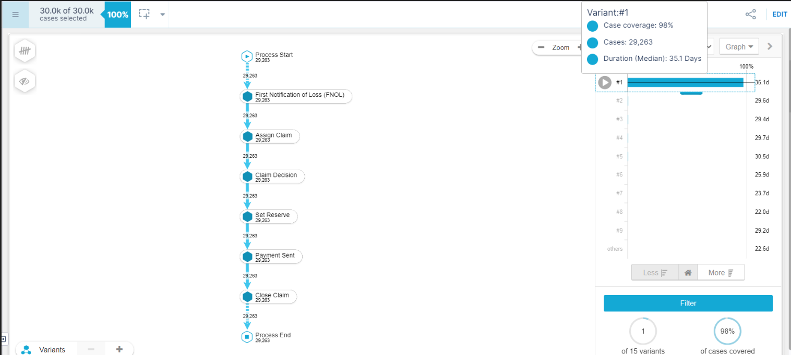
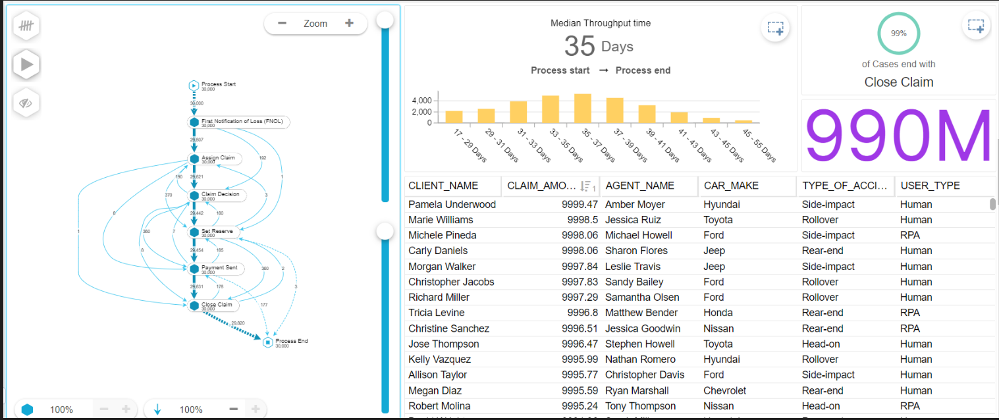
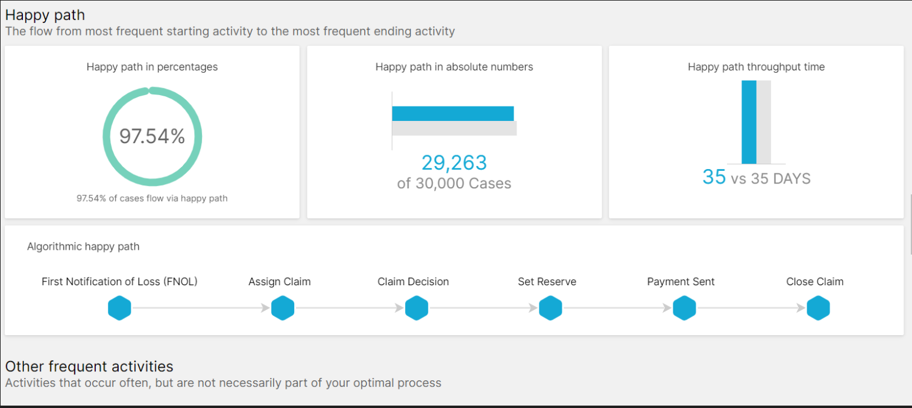
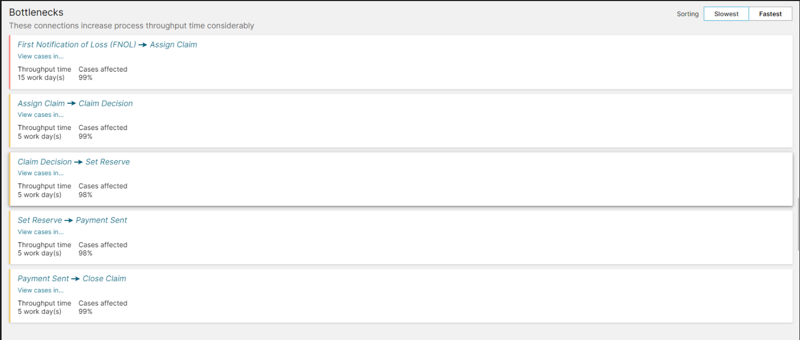
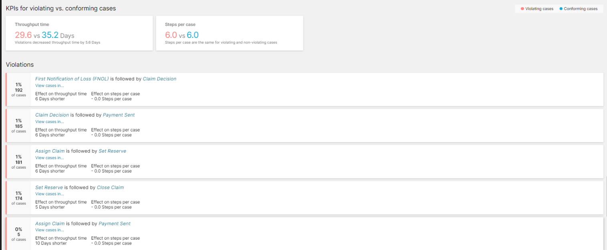
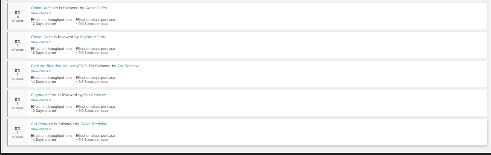

# PFA-Process-Mining-Fraud-detection

## Project architecture

## Description

- **Dataset** : https://www.kaggle.com/datasets/carlosalvite/car-insurance-claims-event-log-for-process-mining?resource=download
- This event log has been artificially generated and curated to provide a comprehensive view of car insurance claims, allowing users to discover and identify bottlenecks, automation opportunities, conformance issues, reworks, and potential fraudulent cases using any process mining software.

> **Standard Process flow:** _First Notification of Loss (FNOL) → Assign Claim → Claim Decision → Set Reserve → Payment Sent → Close Claim_

- **Goal** : a Fraud detection system, combining the power of process mining analysis and machine learning. Analyzed event logs to identify suspicious patterns, then predicted fraud likelihood using ML.

## Features

| Feature Name                      | Description                                                                                                                                | Type        | Example                              |
| --------------------------------- | ------------------------------------------------------------------------------------------------------------------------------------------ | ----------- | ------------------------------------ |
| case_id                           | A unique identifier for each insurance claim case.                                                                                         | Categorical | 000112d5-9d04-450f-820f-3edfc0626cf9 |
| client                            | The name of the client involved in the claim.                                                                                              | Categorical | Kimberly Collins                     |
| agent                             | The name of the insurance agent assigned to the claim.                                                                                     | Categorical | Hannah Lopez                         |
| adjuster                          | The name of the adjuster responsible for handling the claim.                                                                               | Categorical | Joy Simpson                          |
| claim_amount                      | The monetary value of the insurance claim.                                                                                                 | Numerical   | 9266.19                              |
| client_age                        | The age of the client involved in the claim.                                                                                               | Numerical   | 60                                   |
| type_of_policy                    | The type of insurance policy covering the claim. Possible values include: Comprehensive, Collision, etc.                                   | Categorical | Comprehensive                        |
| car_brand                         | The brand of the car involved in the accident.                                                                                             | Categorical | Hyundai                              |
| car_model                         | The model of the car involved in the accident.                                                                                             | Categorical | Elantra                              |
| car_year                          | The manufacturing year of the car involved in the accident.                                                                                | Numerical   | 2021                                 |
| type_of_accident                  | The type of accident involved in the claim. Possible values include: Head-on, Rear-end, Side-impact, Rollover, etc.                        | Categorical | Head-on                              |
| user_type                         | Indicates whether the user handling the claim is a human or an RPA (Robotic Process Automation).                                           | Categorical | Human                                |
| total_activities                  | The total number of activities recorded for the claim process.                                                                             | Numerical   | 6                                    |
| throughput_duration_days          | The total duration of the claim processing in days.                                                                                        | Numerical   | 31                                   |
| First Notification of Loss (FNOL) | The sequential order of the activity "First Notification of Loss" in the claim process.                                                    | Numerical   | 1                                    |
| Assign Claim                      | The sequential order of the activity "Assign Claim" in the claim process.                                                                  | Numerical   | 2                                    |
| Claim Decision                    | The sequential order of the activity "Claim Decision" in the claim process.                                                                | Numerical   | 3                                    |
| Set Reserve                       | The sequential order of the activity "Set Reserve" in the claim process.                                                                   | Numerical   | 4                                    |
| Payment Sent                      | The sequential order of the activity "Payment Sent" in the claim process.                                                                  | Numerical   | 5                                    |
| Close Claim                       | The sequential order of the activity "Close Claim" in the claim process.                                                                   | Numerical   | 6                                    |
| State                             | The final status of the claim, indicating whether it was valid, fraudulent or violation. Possible values include: valid, fraud, violation. |             | valid                                |

## Process Mining

- **Process Mining Analysis** : https://academic-celonis-splpne.eu-2.celonis.cloud/package-manager/ui/studio/ui/spaces/aebbc40f-08d6-4a61-98c8-139fdddc5384/packages/1c7bb36f-f7bf-402d-93ce-7b17d5edd05d/nodes/a596af0e-ae07-44d9-96be-62cb7e679638#!/documents/a596af0e-ae07-44d9-96be-62cb7e679638/view/sheets/299b84d5-52eb-4525-93f7-544d92d6b2d0/b/6a0d1817-2b4c-4261-974d-96681dafcbd3

## Tools

- Celonis
- python & jupyter notebook
